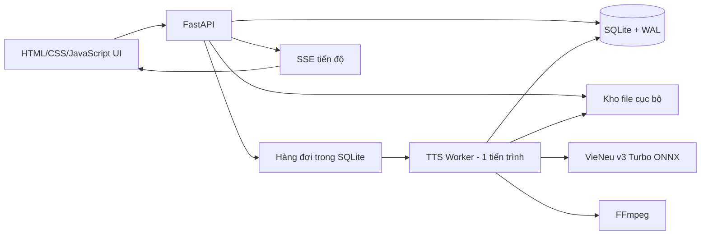
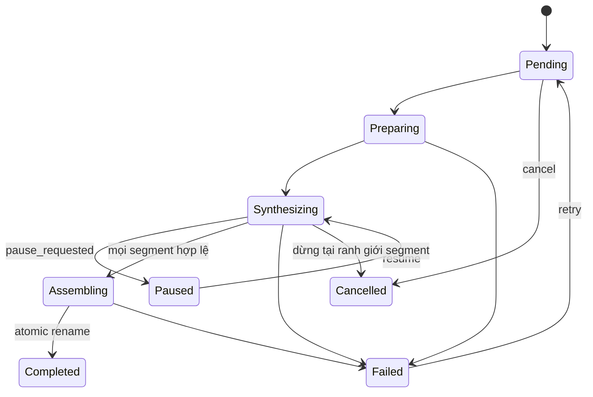

# Kiến trúc ứng dụng EPUB → VieNeu-TTS

> **Trạng thái tài liệu:** File này bắt đầu như bản thiết kế trước implementation và còn giữ các edge case lịch sử. Nguồn sự thật hiện tại là `PROJECT_STATUS.md`, `docs/DECISIONS.md`, `docs/DATA_MODEL.md` và migrations checksum-locked. Khi nội dung bên dưới dùng từ “đề xuất”, không được hiểu là feature/schema đã tồn tại.

Ranh giới Personal Edition hiện tại:

```text
Story Audio: EPUB → approved text → resolved casting → audio → speech timing → Handoff V1
YouTube Auto: Handoff V1 → visual timeline/bible → image → subtitle render → video → metadata/thumbnail
```

ADR-013 được triển khai ở schema v3: Book Voice Profile ba nhóm (narrator/male/female), unknown fallback, optional character override và UI Manual Casting hiển thị effective resolution.

## 1. Mục tiêu

Ứng dụng desktop/web cục bộ cho phép:

- Nhập và quản lý EPUB.
- Hiển thị mục lục, tìm kiếm và chọn một hoặc nhiều chương.
- Chọn preset voice VieNeu; manual/multi-voice casting và Three-Voice Profile core cấp book đã có.
- Xem trước giọng trước khi chạy chương dài.
- Xếp hàng, tạm dừng, tiếp tục và thử lại công việc TTS.
- Tạo một file audio hoàn chỉnh cho mỗi chương; tùy chọn chia chương thành nhiều phần theo thời lượng.
- Lưu checkpoint ở cấp đoạn để không phải đọc lại phần đã hoàn thành.
- Nghe audio, theo dõi tiến độ và mở thư mục đầu ra ngay trong UI.

EPUB hiện tại là **Quang Âm Chi Ngoại** của **Nhĩ Căn**, gồm **1.980 chương**. Các chương mẫu dài khoảng 4.900–6.900 ký tự, nên hệ thống phải xử lý theo hàng đợi và tránh nạp toàn bộ sách vào bộ nhớ.

## 2. Kiến trúc tổng thể



Đây là **modular monolith**: một backend nhưng chia thành các mô-đun độc lập. Nó đơn giản để cài trên một máy, dễ sửa lỗi hơn microservice, và các ranh giới vẫn đủ rõ để tách TTS worker sang máy khác sau này.

## 3. Công nghệ đề xuất

| Phần | Công nghệ | Lý do |
|---|---|---|
| UI | HTML/CSS/JavaScript | UI local hiện tại, không cần build tool |
| Backend | FastAPI + Pydantic | Phù hợp hệ sinh thái Python của VieNeu |
| Cơ sở dữ liệu | SQLite WAL + forward-only SQL migrations | Không cần server DB; migration checksum-locked |
| EPUB | EbookLib + lxml/BeautifulSoup | Đọc OPF, spine, NAV/NCX và làm sạch XHTML |
| TTS | Adapter gọi trực tiếp `vieneu.Vieneu` | Giữ model trong RAM, không phụ thuộc endpoint Gradio |
| Audio | soundfile + FFmpeg | Ghép, chuẩn hóa, đổi WAV/M4A/MP3 và ghi metadata |
| Cập nhật UI | Server-Sent Events (SSE) | Một chiều, đơn giản và đủ cho tiến độ công việc |
| Kiểm thử | Python `unittest` offline + JavaScript syntax check | Không gọi Gemini/VieNeu thật trong suite mặc định |

Không gọi API nội bộ của Gradio. Giao diện VieNeu tại cổng 7861 vẫn có thể dùng riêng, còn ứng dụng mới dùng SDK qua một adapter ổn định.

## 4. Các mô-đun backend

```text
story_audio/
├── api.py               # FastAPI/lifecycle
├── pipeline.py          # Queue, checkpoint, TTS, assemble/export
├── epub.py              # EPUB import
├── text.py              # Reflow, QA, chunking, lexical validation
├── casting.py           # Character + immutable CastingPlan
├── tts.py               # VieNeu adapter
├── storage.py           # Content-addressed blobs
├── migrations/          # Forward-only checksum migrations
└── youtube_handoff.py   # Immutable Handoff V1 exporter/verifier
```

Các interface quan trọng:

- `BookImporter`: EPUB → metadata + danh sách chương + nội dung sạch.
- `TextChunker`: nội dung chương → các đoạn ổn định theo câu.
- `TtsEngine`: `list_voices()`, `preview()`, `synthesize()`.
- `AudioAssembler`: kiểm tra segment, ghép chapter, encode đầu ra.
- `JobRepository`: nhận việc, heartbeat, checkpoint, retry.
- `Storage`: quy ước đường dẫn; domain không tự ghi file trực tiếp.

VieNeu được bọc bởi `VieNeuAdapter`. Nếu đổi sang model khác, chỉ cần thêm adapter mới thay vì sửa EPUB, hàng đợi hoặc UI.

## 5. Mô hình dữ liệu

Schema thực thi hiện tại là version 3; xem `docs/DATA_MODEL.md` và `story_audio/migrations/`. Các entity chính:

- `books`, `chapters`: metadata EPUB; full chapter text không nằm trong SQLite.
- `text_revisions`: raw/reflowed/repaired metadata trỏ tới content-addressed text blob.
- `book_voice_profiles`: ba voice mặc định, unknown fallback policy và config version theo book.
- `characters`: `display_name`, optional gender/voice override; `default_voice_id NOT NULL` được giữ cho compatibility.
- `casting_plans` + JSON blob: immutable assignment pin TextRevision/utterance offsets.
- `jobs`, `job_chapters`: orchestration và immutable settings/voice snapshot.
- `repair_blocks`, `segments`: checkpoint Gemini/TTS; segment pin `resolved_voice_id`.
- `artifacts`: verified master/export/timeline files cùng hash/dependency.

Model core đã triển khai:

```text
BookVoiceProfile(narrator, male_dialogue, female_dialogue, unknown_fallback)
Character(identity, aliases, gender, role, optional voice_override)
```

BookVoiceProfile/gender/optional override có trong schema v3. Giá trị `characters.default_voice_id` cũ được bảo toàn và migrate sang legacy override. Job cũ không được resolve lại.

## 6. Luồng xử lý một chương



1. Chuẩn hóa text nhưng giữ dấu câu tiếng Việt.
2. Bỏ tiêu đề chương bị lặp nếu được cấu hình.
3. Chia theo đoạn/câu, mục tiêu 180–240 ký tự và không vượt `max_chars=256`.
4. Ghi toàn bộ segment vào DB trước khi bắt đầu TTS.
5. Worker xử lý tuần tự; mỗi segment thành công được ghi file tạm rồi đổi tên nguyên tử.
6. Sau mỗi segment, cập nhật checkpoint trong một transaction.
7. Khi đủ segment, kiểm tra sample rate/kênh và ghép theo thứ tự.
8. Ghi file chương vào tên `.partial`, kiểm tra bằng FFprobe, sau đó đổi tên thành file chính thức.
9. Chỉ đánh dấu `Completed` sau khi file cuối tồn tại và kiểm tra thành công.

Không nối các mảng audio của cả chương trong RAM. FFmpeg đọc lần lượt các segment để tránh tăng bộ nhớ ở chương dài.

## 7. Checkpoint và khả năng phục hồi

Checkpoint là dữ liệu trong DB cộng với file segment đã hoàn tất:

- Khi ứng dụng mở lại, job `running` có heartbeat hết hạn được chuyển thành `interrupted`.
- Worker đối chiếu `text_sha256`, cấu hình snapshot và file segment.
- Segment có DB record nhưng file thiếu/hỏng được đưa về `pending`.
- Segment hợp lệ được giữ lại; worker tiếp tục từ segment chưa hoàn thành đầu tiên.
- Thay giọng hoặc thay thiết lập tạo **job revision mới**, không trộn audio cũ và mới.
- Retry mặc định tối đa 3 lần/segment, có backoff; sau đó chương chuyển `failed` nhưng hàng đợi có thể tiếp tục chương kế tiếp.
- Pause/cancel chỉ có hiệu lực giữa hai segment để không tạo WAV dở dang.

Khóa công việc dùng cơ chế lease + heartbeat trong SQLite. Nếu worker chết, lease hết hạn và công việc có thể được nhận lại an toàn.

## 8. Cấu trúc lưu trữ

```text
data/
├── app.db
├── blobs/
│   ├── text/<prefix>/<sha>.txt
│   └── casting/<prefix>/<sha>.json
├── work/
│   └── job_<id>/chapter_<number>/segments/*.wav
├── output/<book>/<chapter>/<job>/render_<generation>/
│   ├── chapter_master.wav
│   ├── chapter.m4a|mp3
│   └── segment_timeline.json
└── exports/youtube_auto/<export-id>/
    ├── handoff.json
    ├── content.md
    ├── audio/narration.<ext>
    ├── speech_timeline.json
    └── character_seed.json
```

Tên thật hiển thị trong metadata; tên file được làm sạch để tránh ký tự không hợp lệ trên Windows. Text/casting payload dùng content-addressed blobs; artifact paths hiện vẫn có absolute path trong DB và restore remap chúng.

Mặc định nên xuất **M4A/AAC hoặc MP3** và chỉ giữ WAV segment đến khi xác nhận file chương hoàn tất. Với sách 1.980 chương, giữ toàn bộ WAV trung gian sẽ tốn rất nhiều dung lượng.

## 9. Thiết kế UI

### Thư viện

- Thẻ sách: bìa, tên, tác giả, số chương, số chương đã có audio.
- Nút nhập EPUB và mở sách.

### Trang sách

```text
┌──────────────────────────────────────────────────────────────────────┐
│ Quang Âm Chi Ngoại                         [Hàng đợi] [Cài đặt]      │
├──────────────────────┬───────────────────────────────────────────────┤
│ Tìm chương...        │ Chương 125                                   │
│ □ Chọn tất cả lọc    │ Nội dung xem trước...                        │
│ ☑ 123  Hoàn tất      │                                               │
│ ☑ 124  Hoàn tất      │ Giọng: [Bình An ▼]  [Nghe thử]               │
│ ☑ 125  Chờ xử lý     │ Đầu ra: [M4A ▼]  Chia phần: [Không ▼]        │
│ □ 126  Chưa tạo      │                                               │
│ ...                  │ [Thêm chương đã chọn vào hàng đợi]            │
├──────────────────────┴───────────────────────────────────────────────┤
│ Đang đọc: Chương 125 · đoạn 14/27 · 52%  [Tạm dừng] [Dừng sau đoạn] │
└──────────────────────────────────────────────────────────────────────┘
```

Danh sách 1.980 chương phải dùng virtual scrolling, phân trang phía backend và bộ lọc trạng thái. Không render toàn bộ chương cùng lúc.

### Hàng đợi

- Tiến độ tổng, chương hiện tại, segment hiện tại, thời gian đã chạy và ETA gần đúng.
- Tạm dừng, tiếp tục, hủy, retry chương lỗi, tăng/giảm ưu tiên.
- Log thân thiện theo chương; log kỹ thuật chi tiết nằm trong màn hình chẩn đoán.

### Quản lý giọng

- Danh sách preset lấy từ VieNeu.
- Hiện có voice preview và Character Manager/manual casting.
- UI cấu hình profile/override và hiển thị resolution source/needs-review trong casting đã hoàn thành.
- Không sửa voice của CastingPlan/job cũ; thay profile/override chỉ ảnh hưởng plan/job mới.
- Voice cloning nằm ngoài phạm vi Personal Edition hiện tại.

### Trình phát

- Phát/tạm dừng, tua, tốc độ nghe, chương trước/sau.
- Tự chuyển sang chương đã hoàn thành kế tiếp.
- Hiển thị và mở thư mục file đầu ra.

## 10. API chính

```text
POST   /api/books/import
GET    /api/books
GET    /api/books/{book_id}
GET    /api/books/{book_id}/chapters?offset=&limit=&status=&query=
GET    /api/chapters/{chapter_id}

GET    /api/voices
POST   /api/voices/clone
POST   /api/voices/{voice_id}/preview
DELETE /api/voices/{voice_id}

POST   /api/jobs
GET    /api/jobs
GET    /api/jobs/{job_id}
POST   /api/jobs/{job_id}/pause
POST   /api/jobs/{job_id}/resume
POST   /api/jobs/{job_id}/cancel
POST   /api/jobs/{job_id}/retry
GET    /api/events                  # SSE

GET    /api/audio/{chapter_id}
GET    /api/health
GET    /api/diagnostics
```

`POST /api/jobs` nhận `chapter_ids`, `voice_id`, tùy chọn audio và thiết lập TTS. Backend xác thực tất cả chương thuộc cùng sách và chụp snapshot cấu hình trước khi trả về.

## 11. Quy tắc để dễ bảo trì

- UI không biết đường dẫn VieNeu hoặc thao tác file.
- API route không gọi SDK VieNeu trực tiếp.
- Domain không import FastAPI, SQLAlchemy, FFmpeg hoặc VieNeu.
- Mỗi thay đổi schema DB đều có forward-only SQL migration checksum-locked; migration kế tiếp nếu cần là `0004_*`.
- Dùng enum và state transition rõ ràng, không cập nhật status tùy ý.
- Tất cả thao tác tạo file cuối đều atomic và idempotent.
- Structured logs có `job_id`, `chapter_id`, `segment_id`; không lưu toàn bộ nội dung truyện vào log.
- Cấu hình đường dẫn và model nằm trong một file; không hard-code `D:\\Youtube` trong mã.
- Adapter contract tests bảo đảm VieNeu upgrade không âm thầm phá pipeline.

## 12. Kiểm thử bắt buộc

- EPUB thiếu NAV nhưng có NCX; spine lệch mục lục; XHTML lỗi nhẹ; chương rỗng.
- Chunker không vượt 256 ký tự khi có thể, giữ nguyên thứ tự và không mất text.
- Dừng tiến trình giữa segment rồi chạy lại không tạo lại segment đã hoàn tất.
- File segment hỏng được phát hiện và sinh lại.
- Pause/resume/cancel đúng tại ranh giới segment.
- Ghép audio đúng thứ tự và không mất khoảng nghỉ.
- Thay voice/config tạo revision mới.
- Import lại cùng EPUB được nhận diện bằng SHA-256, không nhân đôi sách ngoài ý muốn.
- UI xử lý mượt danh sách 1.980 chương.

## 13. Lộ trình triển khai

Đã hoàn thành: Audio MVP, hardening/backup, manual multi-voice casting, Text Diff, shared Gemini cache và YouTube Auto Handoff V1.

Thứ tự Personal Edition tiếp theo:

1. Book-level Character Bible Import.
2. Gemini speaker assignment draft khi thực sự cần.
3. Book-level Character Bible Import.
4. Gemini Speaker Assignment Draft.
5. Real chapter workflow review.

Voice clone, remote worker, distributed locking, generic plugin framework, usage/quota dashboard, incremental backup và mandatory word alignment chỉ làm khi có nhu cầu thực tế. Image/video/metadata/thumbnail thuộc YouTube Auto.

## 14. Quyết định mặc định cho máy hiện tại

- VieNeu v3 Turbo, CPU/ONNX, một worker TTS.
- `max_chars=256`, chunk mục tiêu 180–240 ký tự.
- Temperature mặc định `0.8`, nhưng lưu theo snapshot từng job.
- Audio nội bộ WAV 48 kHz mono; đầu ra mặc định M4A/AAC.
- Một file mỗi chương; tùy chọn chia phần khi vượt 30 phút.
- Chỉ xếp hàng các chương người dùng chọn; không tự động tạo cả 1.980 chương.
- SQLite WAL, checkpoint sau từng segment và tự phục hồi job gián đoạn khi mở ứng dụng.

## 15. Kế hoạch xử lý edge case và thao tác nhầm

### 15.1 Nguyên tắc an toàn chung

- Mọi job phải **immutable về input** sau khi bắt đầu: danh sách chương, `text_revision_id`, giọng, cấu hình TTS, cấu hình export và visual profile đều được chụp snapshot.
- Không ghi đè artifact hoàn chỉnh tại chỗ. Kết quả mới được tạo thành revision mới, verify xong mới cập nhật con trỏ `active_artifact`.
- Pause/cancel chỉ có hiệu lực tại ranh giới segment hoặc stage an toàn.
- Delete mặc định là soft-delete và có thời hạn hoàn tác; file chỉ bị cleanup vật lý sau retention period.
- Một chương lỗi không làm dừng toàn bộ batch, trừ lỗi hệ thống như hết dung lượng hoặc database không ghi được.
- Tất cả thao tác retry, cancel, replace, cleanup và restore phải được ghi `audit_events`.

### 15.2 Chọn nhầm chương hoặc khoảng chương

Trước khi tạo job, UI hiển thị màn hình xác nhận:

```text
Sách: Quang Âm Chi Ngoại
Khoảng: Chương 101 → 120
Tổng: 20 chương
Đã có audio: 6
Sẽ tạo mới: 14
Ước tính thời gian: ...
Ước tính dung lượng: ...
Giọng/Profile: ...
```

Các lựa chọn bắt buộc khi có artifact cũ:

- `Bỏ qua chương đã hoàn tất` — mặc định.
- `Chỉ tạo lại chương lỗi`.
- `Tạo revision mới cho toàn bộ khoảng`.
- Không có lựa chọn ghi đè trực tiếp.

Sau khi bấm chạy, job ở trạng thái `scheduled` trong khoảng 10 giây và có nút **Hoàn tác**. Nếu đã chạy:

- Cancel job chỉ hủy các chapter task chưa bắt đầu.
- Chapter đang TTS dừng sau segment hiện tại.
- Segment và artifact hoàn chỉnh đã có được giữ lại, nhưng đánh dấu `orphaned_by_cancel` nếu chưa muốn nhận làm kết quả chính thức.
- Người dùng có thể chọn **Giữ kết quả đã hoàn thành** hoặc **Đưa vào thùng rác**.

Backend không tin trực tiếp `from/to` từ UI. Nó resolve thành danh sách `chapter_id`, kiểm tra cùng một sách, đúng thứ tự, không trùng và trả lại preview trước khi commit job.

### 15.3 Chọn nhầm giọng hoặc cấu hình

- Luôn yêu cầu nghe preview 10–20 giây trước lần đầu dùng một profile mới; có thể bỏ qua cảnh báo nhưng quyết định được ghi audit.
- Voice/profile bị khóa theo snapshot khi job bắt đầu.
- Đổi profile chỉ áp dụng cho chapter task chưa bắt đầu nếu người dùng chọn **Tạo job mới từ phần còn lại**.
- Không thay profile âm thầm cho chapter đang render.
- Nếu phát hiện chọn nhầm, nút **Dừng sau segment hiện tại và tạo lại phần còn lại** tạo một job mới; job cũ vẫn truy vết được.
- Artifact mang `synthesis_hash`, nên audio khác giọng hoặc temperature không thể bị ghép chung.

### 15.4 Chọn nhầm text revision hoặc sửa text khi đã có audio

- Mỗi job pin một `text_revision_id` bất biến.
- Sửa punctuation, xóa quảng cáo hoặc chỉnh tên riêng tạo revision mới.
- Khi revision mới được duyệt, UI đánh dấu audio/subtitle/image/video cũ là `stale`, không tự xóa.
- Người dùng có thể tạo lại từ stage cần thiết:
  - Text đổi → TTS, alignment, subtitle, scene, image prompt và video đều stale.
  - Chỉ đổi punctuation nhưng lexical text giữ nguyên → vẫn tạo lại TTS vì nhịp đọc có thể đổi.
  - Chỉ đổi visual profile → giữ audio/alignment, tạo lại prompt, image và video.
  - Chỉ đổi output format → giữ master audio, encode lại.

### 15.5 Gemini punctuation repair lỗi

Các trường hợp:

- Timeout, rate limit, quota hoặc mạng lỗi: retry có exponential backoff và jitter.
- Gemini trả JSON lỗi: retry cùng block, không mất block đã hoàn thành.
- Gemini thêm/xóa/đổi từ: lexical integrity check thất bại, kết quả bị cách ly và không đi vào TTS.
- Một block thất bại nhiều lần: chapter chuyển `needs_review`; các chapter khác tiếp tục.
- Model hoặc prompt version thay đổi giữa batch: job cũ giữ snapshot; job mới dùng version mới.
- API trả kết quả khác nhau khi retry: chỉ kết quả vượt toàn bộ validator mới được ghi thành revision.

Chế độ chạy Gemini:

- `off`: chỉ deterministic reflow.
- `qa_only`: chỉ sửa block bị QA cảnh báo — mặc định.
- `all_selected`: sửa toàn bộ chapter đã chọn.

Gemini có thể chuẩn bị trước TTS 2–5 chương. Nếu hàng đợi repair đầy hoặc API bị lỗi, TTS hoàn tất các chương đã sẵn sàng rồi chuyển sang `waiting_for_text`, không thất bại cả job.

### 15.6 EPUB và Text QA edge cases

- EPUB nhập lại cùng SHA-256: hỏi dùng bản đã có hay tạo edition mới.
- Cùng tên sách nhưng SHA khác: tạo edition/revision, không ghi đè.
- NAV/NCX thiếu hoặc spine sai: import ở trạng thái warning và cho xem preview chapter mapping.
- XHTML hỏng nhẹ: parser recovery; nội dung phục hồi phải qua QA.
- Chương rỗng/quá ngắn: chặn TTS và đánh dấu review.
- Hard-wrap thành nhiều `<p>`: lossless reflow nối whitespace trước khi QA/Gemini.
- Tiêu đề lặp, watermark, quảng cáo và credit dịch: tạo QA issue; rule tự xóa phải có audit và preview diff.
- Chương trùng tuyệt đối: phát hiện bằng SHA-256.
- Chương gần trùng: phát hiện bằng SimHash/MinHash và yêu cầu review.
- Ký tự Trung, mojibake hoặc HTML sót: warning/error theo tỷ lệ, không tự ý thay tên riêng.

### 15.7 VieNeu/TTS edge cases

- Model chưa tải hoặc khởi tạo lỗi: job ở `waiting_for_engine`, không tăng attempt của segment.
- TTS process crash: lease hết hạn; worker mới kiểm tra file rồi tiếp tục segment chưa hoàn thành.
- Output rỗng, NaN, clipping nặng, duration bất thường hoặc sample rate sai: segment bị reject và retry.
- Segment dài nhưng audio quá ngắn, hoặc ngược lại: quality heuristic cảnh báo.
- Segment retry vẫn lỗi: chapter `failed`, job chuyển sang chapter tiếp theo.
- Voice clone reference mất/hỏng: profile unavailable; không fallback sang giọng mặc định vì có thể tạo hàng loạt audio sai giọng.
- Model version thay đổi: `engine_version` nằm trong synthesis hash; không trộn artifact khác version.
- TTS gọi nội bộ tự chia text: adapter phải bảo đảm application segment không vượt capability của engine để checkpoint không bị ẩn bên trong SDK.

### 15.8 Mất điện, đóng ứng dụng hoặc kill process

- DB chạy WAL, transaction ngắn và `busy_timeout` phù hợp.
- File được ghi `.partial`, flush/fsync khi cần, verify rồi atomic rename.
- Worker heartbeat và lease; startup recovery nhận diện job `running` đã hết lease.
- Khi mở lại:
  1. Kiểm tra SQLite integrity.
  2. Quét `.partial` và segment chưa finalize.
  3. Đối chiếu DB, file size, audio duration và SHA-256.
  4. Giữ artifact hợp lệ, xóa/cách ly file hỏng.
  5. Chuyển job thành `interrupted` và cho auto-resume theo cài đặt.
- Không đánh dấu stage hoàn tất chỉ vì process kết thúc với exit code 0; phải verify artifact.

### 15.9 Hết dung lượng ổ đĩa

- Trước job, ước tính dung lượng audio tạm và output; cảnh báo nếu không đủ headroom.
- Mặc định yêu cầu còn tối thiểu 15 GB hoặc ngưỡng cấu hình.
- Worker kiểm tra free space trước mỗi chapter và trước audio assemble/export.
- Nếu xuống dưới hard threshold: pause toàn bộ producer, không để FFmpeg hoặc TTS ghi file dở.
- Cleanup theo thứ tự an toàn:
  1. `.partial` quá hạn không còn lease.
  2. Cache có thể tái tạo.
  3. WAV segment của chapter đã finalized và hết retention.
  4. Revision artifact đã soft-delete và hết thời hạn hoàn tác.
- Không tự xóa master audio, timeline, Handoff manifest hoặc export đang active.

### 15.10 Audio assembly và alignment edge cases

- Thiếu một segment: không assemble.
- Segment trùng index hoặc hash không đúng: reject chapter revision.
- Crossfade làm thay đổi timeline: timeline builder phải dùng duration sau overlap, không chỉ cộng duration thô.
- FFmpeg/FFprobe lỗi: giữ segment, retry assemble; không gọi lại TTS.
- File cuối duration lệch tolerance: artifact ở `verification_failed`.
- Alignment segment-level luôn lấy từ WAV đã verify.
- Forced alignment ngoài thất bại: vẫn giữ segment timeline; subtitle được đánh dấu độ chính xác `segment` thay vì `word`.
- Thay đổi tốc độ hậu kỳ: tạo timeline/export revision mới trước khi sinh subtitle/video.

### 15.11 YouTube Auto Handoff edge cases

- Bundle chỉ dùng relative paths, schema version và SHA-256; path traversal/symlink bị từ chối.
- Export luôn dùng TextRevision/casting/audio/timeline pin bởi completed job, không dùng active revision mới nhất ngầm định.
- Timeline lệch audio quá tolerance hoặc trộn speaker trong item bị từ chối.
- Export staging lỗi không để bundle partial; cùng source identity được verify/reuse.
- Importer YouTube Auto chỉ đọc bundle và copy audio; không sửa source artifact hoặc gọi lại TTS.
- Scene/image/video edge cases được xử lý trong repository YouTube Auto, không mở rộng Story Audio runner.

### 15.12 Nhiều job và tranh chấp tài nguyên

- Chỉ một VieNeu CPU worker trên máy hiện tại.
- Gemini repair chạy tuần tự với TTS worker hiện tại; không xây distributed scheduler sớm.
- Một chapter revision chỉ có một active synthesis lease cho cùng `synthesis_hash`.
- Hai job yêu cầu cùng artifact: job thứ hai chờ và reuse kết quả, không render trùng.
- SQLite chỉ dùng trên ổ local; không đặt file DB trên network share.

### 15.13 Xóa nhầm và cleanup nhầm

- UI phân biệt `Remove from queue`, `Archive artifact` và `Delete files`.
- Xóa file yêu cầu preview số file/dung lượng và typed confirmation khi phạm vi lớn.
- Soft-delete mặc định 7 ngày.
- Cleanup chỉ xóa artifact có reference count bằng 0, không active, không lease và đã hết retention.
- Manifest/hash vẫn được giữ sau cleanup segment để biết artifact cuối được tạo từ đâu.
- Có lệnh dry-run liệt kê file sẽ xóa trước khi thực thi.

### 15.14 Quan sát, cảnh báo và hỗ trợ sửa lỗi

Mỗi event/log có:

```text
timestamp, level, event_code,
job_id, chapter_id, text_revision_id,
segment_id, artifact_id, attempt,
message, technical_details
```

UI hiển thị thông báo thân thiện; technical details có thể copy từ màn hình chẩn đoán. Dashboard cần có:

- Job/chapter đang chạy và lý do đang chờ.
- Số chapter completed/failed/needs-review.
- Gemini quota/rate-limit gần nhất.
- VieNeu health và model version.
- Dung lượng trống, dung lượng work/cache/output.
- Artifact stale, orphan và sắp bị cleanup.

### 15.15 Ma trận hành động người dùng

| Hành động | Kết quả an toàn |
|---|---|
| Pause | Dừng sau segment/stage an toàn, giữ checkpoint |
| Resume | Verify artifact rồi tiếp tục từ đơn vị chưa hoàn tất |
| Cancel | Không nhận task mới; giữ kết quả hợp lệ đã tạo |
| Retry segment | Chỉ tạo lại segment lỗi |
| Retry chapter | Reuse segment hợp lệ cùng synthesis hash |
| Change voice | Tạo synthesis revision/job mới |
| Change text | Tạo text revision mới và đánh dấu downstream stale |
| Change format | Reuse master audio, chỉ export lại |
| Export Handoff | Verify/reuse cùng identity; không sửa source artifact |
| Delete | Soft-delete trước, cleanup vật lý sau retention |

### 15.16 Acceptance tests cho phục hồi

- Chọn nhầm 100 chương, cancel trong thời gian undo và sau khi đã render 3 segment.
- Đóng app, kill worker và mất điện giả lập ở mọi ranh giới stage.
- Làm hỏng/xóa ngẫu nhiên một WAV segment rồi resume.
- Đổi giọng khi batch đang chạy; xác nhận không trộn giọng giữa chapter/artifact.
- Gemini thêm một từ; lexical validator phải chặn.
- Gemini quota hết giữa batch; các chương đã repair vẫn tiếp tục TTS.
- Ổ đĩa xuống dưới hard threshold giữa assemble; pipeline phải pause an toàn.
- FFmpeg lỗi sau khi TTS hoàn tất; retry không được gọi lại VieNeu.
- Hai job cùng yêu cầu một chapter/profile; chỉ một synthesis thực sự chạy.
- Cleanup chạy đồng thời với worker; không xóa file đang lease.
- Sửa text, casting/voice profile và output format; kiểm tra invalidation đúng phạm vi.
- Khởi động lại sau khi DB có job `running` nhưng heartbeat đã hết hạn.

## 16. Phạm vi MVP đã chốt

MVP kết thúc ở audio theo chương có checkpoint và **bao gồm Gemini punctuation repair**. Image generation và video composition nằm ngoài Story Audio và được nối qua YouTube Auto Handoff V1.

### 16.1 Pipeline MVP

```text
EPUB
→ Import + SHA check
→ Raw TextRevision
→ Lossless reflow
→ Reflowed TextRevision
→ Text QA
→ Gemini punctuation repair
→ Lexical integrity validation
→ Approved TextRevision
→ VieNeu segment render
→ Segment verification + checkpoint
→ Assemble master audio
→ FFprobe verification
→ Export M4A/MP3 + segment timeline manifest
```

### 16.2 Có trong MVP

- Import EPUB và hiển thị danh sách chương.
- Chọn một chương, nhiều chương hoặc khoảng `từ chương → đến chương`.
- Preview raw/reflowed/repaired text và diff thay đổi dấu câu.
- Lossless reflow để sửa hard-wrap của EPUB.
- QA cơ bản: chương rỗng/ngắn, hard-wrap, quảng cáo, HTML rác, ký tự lỗi và nội dung trùng.
- Gemini punctuation repair theo chapter batch hằng ngày.
- Ba chế độ Gemini: `off`, `qa_only`, `all_selected`.
- Lexical validator bảo đảm Gemini không thêm, xóa, đổi hoặc đảo từ.
- Chọn preset voice và nghe thử.
- VieNeu v3 Turbo CPU/ONNX, một TTS worker.
- Checkpoint cấp Gemini block và TTS segment.
- Pause, resume, cancel, retry và phục hồi sau restart.
- Một master audio và một M4A/MP3 cho mỗi chương.
- Segment timeline manifest và Handoff V1 để YouTube Auto dùng cho downstream.
- Artifact/revision, stale propagation, soft-delete và cleanup WAV tạm.
- UI hàng đợi, tiến độ, lỗi cần review và trình phát audio.

### 16.3 Chưa có trong MVP

- Voice cloning.
- Word-level forced alignment.
- SRT/VTT hoàn chỉnh trên UI.
- Book-level Character Bible và automatic speaker assignment.
- Book Voice Profile ba nhóm/unknown resolver và UI integration.
- Scene planning, image generation, video composition và metadata/thumbnail trong Story Audio; các phần này thuộc YouTube Auto.
- Nhiều TTS worker hoặc remote worker.

### 16.4 Gemini repair contract

Gemini chỉ được phép:

- Thêm, xóa hoặc thay đổi dấu câu.
- Thay đổi khoảng trắng và xuống đoạn.
- Chuẩn hóa kiểu dấu ngoặc kép nếu không thay đổi từ.

Gemini không được phép:

- Thêm, xóa, thay hoặc đảo thứ tự từ.
- Sửa tên riêng hoặc thuật ngữ tu luyện.
- Tóm tắt, diễn giải hoặc làm văn phong tự nhiên hơn.
- Xóa quảng cáo; việc đó thuộc Cleaner và phải có audit riêng.

Mỗi request dùng JSON schema có `block_id` và `repaired_text`. Chapter được chia thành block khoảng 1.500–2.500 ký tự tại ranh giới an toàn. Mỗi block pin:

```text
source_sha256
lexical_sha256
model_id
prompt_version
repair_mode
attempt
status
```

Kết quả chỉ được chấp nhận khi:

1. JSON hợp lệ và đúng `block_id`.
2. Text không rỗng và không vượt ngưỡng biến đổi bất thường.
3. Chuỗi token chữ/số sau khi bỏ dấu câu và whitespace giống hệt input.
4. QA punctuation sau sửa không xấu hơn trước.
5. Toàn bộ block của chapter đã verified.

Nếu validator thất bại, kết quả được giữ làm diagnostic nhưng không trở thành TextRevision được duyệt.

### 16.5 Gemini scheduling

- Gemini worker là network worker riêng, không chiếm TTS resource slot.
- Chuẩn bị trước VieNeu 2–5 chương để tạo pipeline liên tục.
- Cache theo `source_sha256 + model_id + prompt_version + repair_mode`.
- Retry có exponential backoff và jitter cho timeout/rate limit.
- Hết quota chuyển task sang `waiting_for_quota`, không đánh dấu chapter failed.
- Một block lỗi không làm mất các block đã verified.
- Chapter `needs_review` không vào TTS; các chapter khác trong batch tiếp tục.
- Đổi model/prompt chỉ áp dụng cho task chưa bắt đầu hoặc job revision mới.

### 16.6 Quản lý Gemini API key

Thứ tự nạp key:

1. Biến môi trường `GEMINI_API_KEY`.
2. File local `secrets/gemini_api_key.txt` nếu biến môi trường không có.

Quy tắc:

- `secrets/`, `.env`, `*.key` và file key phải nằm trong `.gitignore`.
- Không lưu key vào SQLite, project manifest, log, audit event hoặc UI state.
- UI chỉ hiển thị `configured/not configured`, không trả key về browser.
- Không ghi URL request chứa key vào log.
- Khi key lỗi xác thực, task dừng ở `waiting_for_credentials`; không retry vô hạn.
- Có thể thay key rồi resume mà không tạo lại các block đã verified.

### 16.7 MVP data model bổ sung

```text
text_repair_tasks
- id
- chapter_id
- source_text_revision_id
- block_index
- source_path
- repaired_path
- source_sha256
- lexical_sha256
- model_id
- prompt_version
- status
- attempt_count
- error_code
- error_message
- lease_owner
- lease_expires_at
- created_at
- verified_at
```

Text vẫn lưu trong content-addressed file storage; bảng chỉ giữ metadata và đường dẫn. `Approved TextRevision` chỉ được tạo sau khi toàn bộ repair task của chương hoàn tất và verified.

### 16.8 MVP acceptance criteria

- Chọn chương 100–110 và chế độ Gemini `all_selected`.
- Gemini repair, validate và VieNeu render theo dây chuyền, không cần đợi cả batch repair xong.
- Gemini cố tình thêm/xóa một từ trong test fixture; lexical validator phải chặn.
- Kill app giữa Gemini block và giữa TTS segment; mở lại tiếp tục đúng checkpoint.
- Hết quota giữa batch; chapter đã ready tiếp tục TTS, task còn lại chờ quota.
- Đổi API key rồi resume không gọi lại block đã verified.
- Cancel do chọn nhầm khoảng chương không xóa TextRevision hoặc audio hợp lệ đã tạo.
- Đổi punctuation sau khi audio hoàn tất tạo TextRevision mới và đánh dấu audio downstream stale.
- Chương hoàn thành có master audio, M4A/MP3, timeline manifest và đầy đủ artifact hash.
